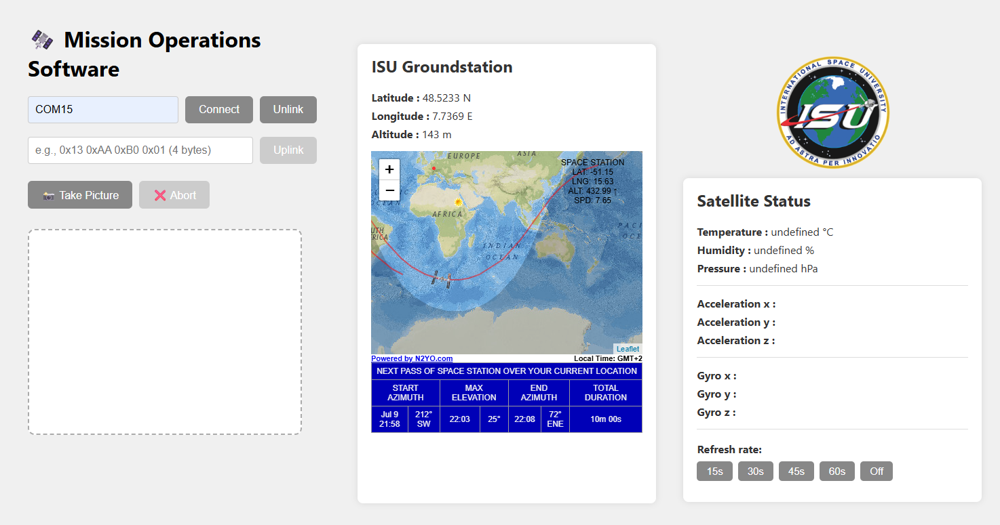

# ESP32 OV2640 Camera Image Transfer via XBee and Python

This project enables you to capture JPEG images and sensor data from an ESP32 (with OV2640 camera and sensors) and transfer them to a PC via XBee wireless modules. A Python/Flask app provides a simple web interface for triggering captures, sending custom uplink commands, adjusting the sensor refresh rate, and viewing sensor data.

---

## 📦 Project Structure

```
/project_root
│-- esp32_program/         # Arduino code for ESP32 (camera, sensors, UART)
│     ├─ esp32_program.ino
│     ├─ camera_sender.h/.cpp
│     ├─ sensors.h/.cpp
│
│-- app.py                 # Flask web server (PC side)
│-- sensors.py             # Serial thread for sensor data (PC side)
│-- photo.py               # Image reception logic (PC side)
│-- static/
│     └─ style.css
│-- templates/
│     └─ index.html
│-- README.md
```

---

## 🛠️ Hardware Setup

- **ESP32** (Freenove Wrover) with OV2640 camera module
- **BME280** (temperature, pressure, humidity) sensor
- **MPU6050** (gyroscope, accelerometer) sensor
- **XBee** module connected to ESP32 UART2 (GPIO32 RX, GPIO33 TX)
- **PC** with XBee USB adapter

Every sensors are connected in I2C to pins 13 and 15 (SDA,SCL)


---

## 🔧 XBee Configuration (with XCTU)

1. **Install XCTU** from Digi International.
2. **Connect** your PC's XBee module via USB-to-serial adapter and open XCTU.
3. **Add device**: Select the COM port and detect your XBee.
4. **Configure both XBees**:
    - **Baud Rate:** 115200 (must match ESP32)
    - **PAN ID:** Same for both modules (e.g., 1234)
    - **Destination Address:** Set each XBee to the other's 64-bit address
    - **API Mode:** Transparent (AT mode)
5. **Write settings** to both modules.

*Tip: Avoid using baud rates above 115200 unless your hardware supports it reliably.*

---

## 🖥️ Arduino IDE Setup (ESP32 Side)

1. **Install Arduino IDE** (1.8+).
2. **Select Board:** "ESP32 Wrover Module".
3. **Connect** camera and XBee as per pin definitions in the code.
4. **Open** the `esp32_program` folder.
5. **Upload** the sketch to your ESP32.

---

## 🗂️ ESP32 Firmware Overview (`esp32_program/`)

- **esp32_program.ino**  
  Main sketch:  
  - Initializes camera, sensors, and UART2 (XBee)
  - Waits for `'c'` command from XBee to trigger image capture
  - Periodically sends sensor data

- **camera_sender.h / camera_sender.cpp**  
  - Camera and UART2 initialization
  - `take_and_send_picture()`: Captures and sends JPEG image with framing

- **sensors.h / sensors.cpp**  
  - Sensor initialization (BME280, MPU6050)
  - Functions to read sensor values
  - `transmit_data()`: Sends all sensor data in a structured frame

---

## 📡 Data Protocols

### Image Transmission (ESP32 → PC)

```
[Start sequence]   // 4 bytes: 0xDE 0xAD 0xBE 0xEF
[Image size]       // 4 bytes, big-endian (MSB first)
[JPEG image data]  // Raw JPEG bytes
[End sequence]     // 4 bytes: 0xFE 0xED 0xFA 0xCE
```

### Sensor Data Transmission (ESP32 → PC)

- Periodically, ESP32 sends a frame:
    - **Header:** 4 bytes (0xA1 0xB2 0xC3 0xD4)
    - **Sensor blocks:** Each block = 4 bytes ID + 3 floats (12 bytes)
        - ID 2: BME280 (temperature, pressure, humidity)
        - ID 3: Gyroscope (x, y, z)
        - ID 4: Accelerometer (x, y, z)
    - **Footer:** 4 bytes (0x1E 0x2D 0x3C 0x4B)

### Uplink Command Protocol (PC → ESP32)

- You can now send any 4-byte uplink command to the ESP32 via the web interface.
- The default "Take Picture" command is:  
  `0x13 0xAA 0xB0 0x01`  
  - `0x13`: Satellite identifier
  - `0xAA`: On-Board Computer
  - `0xB0`: Command for uplink (take picture)
  - `0x01`: Ground Station
- You can enter a custom 4-byte command in the uplink field and send it to the ESP32.

---

## 🐍 Python/Flask App (PC Side)

- **app.py**: Flask web server, handles serial connection, image capture, uplink commands, refresh rate commands, and sensor data API.
    - The command sent to trigger a picture is a 4-byte sequence:  
      `ID_satelite + OBC + BO + GS`  
      - `ID_satelite = 0x13` (satellite identifier)
      - `OBC = 0xAA` (On-Board Computer)
      - `BO = 0xB0` (command to uplink)
      - `GS = 0x01` (Ground Station)
    - You can now send any custom 4-byte uplink command via the web interface.
    - The interface now includes an "Unlink" button to disconnect from the serial port.
    - **Refresh rate buttons** are available in the "Satellite Status" panel to quickly set the periodic sensor data transmission interval (15s, 30s, 45s, 60s, or Off). These buttons send the corresponding 4-byte command to the ESP32.
- **sensors.py**: Background thread to parse and update latest sensor values.
- **photo.py**: Receives and saves images from ESP32.

### How it works:

1. **Connect** to serial port (XBee) via web interface.
2. **Sensor data** is received and parsed in background.
3. **On "Capture" button:**  
   - Sends the 4-byte command (`0x13 0xAA 0xB0 0x01`) to ESP32.
   - Receives and saves JPEG image.
   - Displays image in browser.
4. **On "Uplink" button:**  
   - Sends the custom 4-byte command entered in the uplink field to ESP32.
5. **On "Unlink" button:**  
   - Disconnects from the serial port and disables capture/uplink.
6. **On "Refresh rate" buttons:**  
   - Sends a 4-byte command to the ESP32 to set the periodic sensor data transmission interval:
     - **15s:** `0x13 0xAA 0x15 0x01`
     - **30s:** `0x13 0xAA 0x30 0x01`
     - **45s:** `0x13 0xAA 0x45 0x01`
     - **60s:** `0x13 0xAA 0x60 0x01`
     - **Off:** `0x13 0xAA 0x00 0x01` (disables periodic transmission)
   - These buttons are enabled only when connected.
7. **Sensor values** are updated live in the interface.

---

## ⚙️ Python Environment Setup

Install dependencies:
```
pip install flask pyserial
```

---

## ▶️ Usage

1. **Start Flask app:**
    ```
    python app.py
    ```
2. **Open browser:** Go to `http://localhost:5000`
3. **Connect** to your XBee serial port.
4. **Capture images**, **send uplink commands**, **adjust refresh rate**, and **view sensor data live**.
5. **Unlink** to disconnect from the serial port.

---

## ⚠️ Important Notes

- **Image capture and uplink commands:**  
  The Flask app now supports sending any 4-byte command to the ESP32.  
  The refresh rate buttons send predefined commands for interval control.
  Update your ESP32 firmware accordingly if you use custom command parsing.
- **Baud rates** and **serial port names** must match between ESP32 and PC.
- **Hardware connections** must correspond to pin definitions in the code.
- **Frame format** ensures data integrity for both images and sensor data.
- Images are saved in the `static/` folder.

---

## Exemple of serial monitor of Arduino

15:03:28.384 -> Temp: 25.39 °C
15:03:28.384 -> Pressure: 998.10 hPa
15:03:28.384 -> Humidity: 33.54 %
15:03:28.384 -> Gyro X: -0.03
15:03:28.384 -> Gyro Y: -0.01
15:03:28.384 -> Gyro Z: 0.01
15:03:28.420 -> Accel X: -0.12
15:03:28.420 -> Accel Y: -7.16
15:03:28.420 -> Accel Z: -8.02
15:03:33.487 -> 📸 Capturing image...
15:03:33.593 -> 📦 Image: 85766 bytes
15:03:40.975 -> ✅ Image sent via XBee
15:03:40.975 -> 
15:03:40.975 -> Temp: 25.41 °C
15:03:40.975 -> Pressure: 998.11 hPa
15:03:41.017 -> Humidity: 33.53 %
15:03:41.017 -> Gyro X: -0.03
15:03:41.017 -> Gyro Y: -0.01
15:03:41.017 -> Gyro Z: 0.00
15:03:41.017 -> Accel X: -0.11
15:03:41.017 -> Accel Y: -7.19
15:03:41.017 -> Accel Z: -8.09

## Image of the interface




## 📚 References

- [XBee Arduino Tutorial](https://circuitdigest.com/microcontroller-projects/arduino-xbee-module-interfacing-tutorial)
